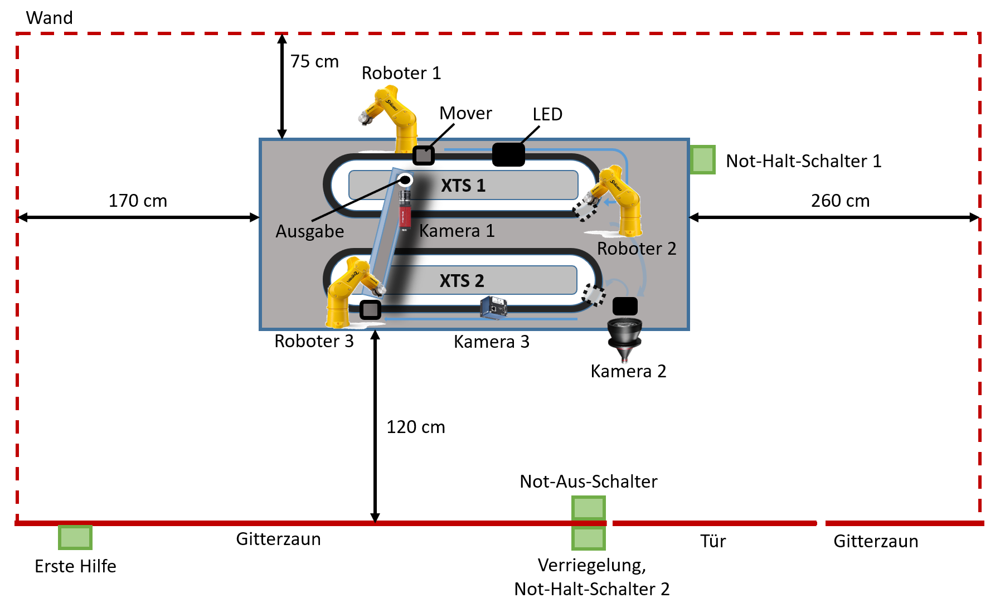
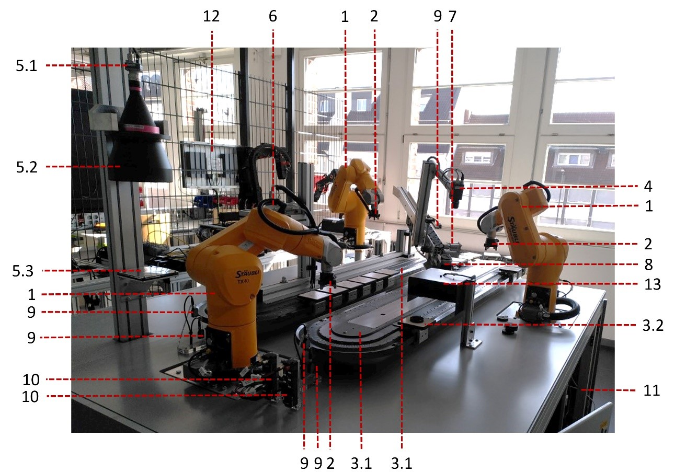
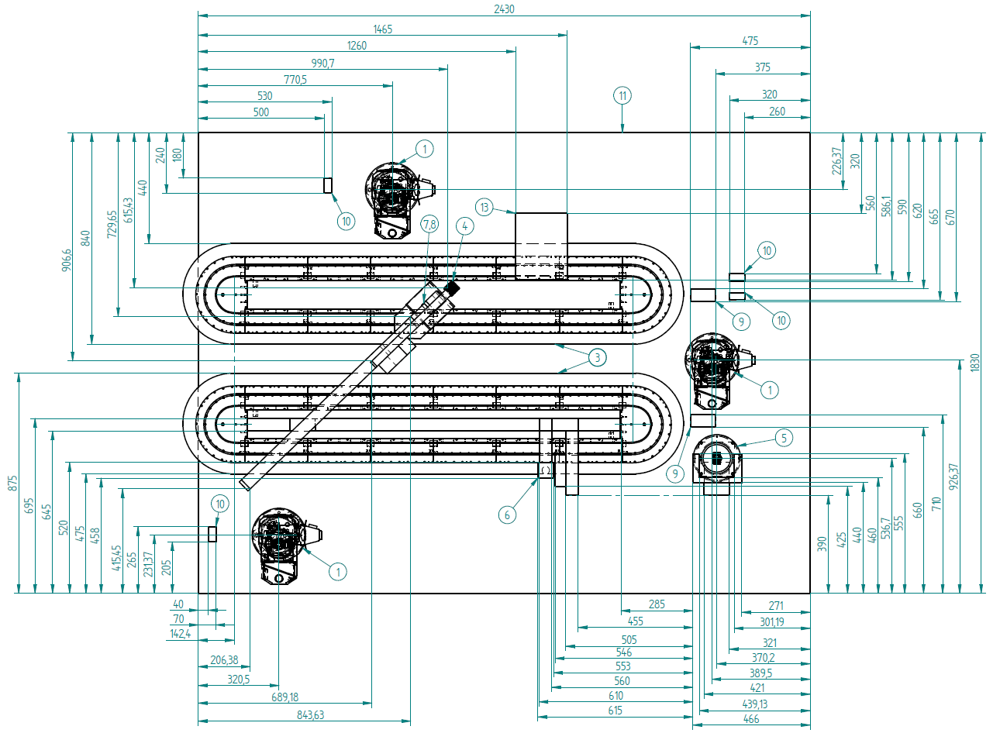

# Komponentenübersicht
Auf dieser Seite bekommen Sie eine Übersicht über die Komponenten des efa-Demonstrators.

## Aufbau
### Schematisch
Den Komponenten sind konkrete Nummern zugeordnet, damit sie eindeutig angesprochen werden können. Auf jeder Komponente wurden daher auch Label mit der entsprechenden Bezeichnung geklebt.

	  
	 Schematischer Aufbau des efa-Demonstrators

### Konkret

	  
	 Aufbau des efa-Demonstrators

| Nr. | Bezeichnung                                | Hersteller     | Typenschild                           |
| :-- | :----------------------------------------- | :------------- | :------------------------------------ |
| 1   | [Roboter](TX40-Staubli.md)                 | Stäubli        | TX40                                  |
| 2   | [Greifer](Greifer-Zimmer.md)               | Zimmer Group   | GPD5004N                              |
| 3.1 | [Transportsystem-XTS](XTS-Beckhoff.md)     | Beckhoff       | AT2000-0250, AT2001-0250, AT2050-0500 |
| 3.2 | [Mover](XTS-Beckhoff.md)                   | Beckhoff       | AT9011_0050                           |
| 4   | [Kamera 1](MantaG125-AlliedVision.md)      | Allied Vision  | Manta G-125                           |
| 5.1 | [Kamera 2](GenieNano-Teledyne.md)          | Teledyne DALSA | Genie Nano M2450 Mono (G3-GM10-M2450) |
| 5.2 | [Objektiv Kamera 2](GenieNano-Teledyne.md) | Coolens        | DTCM230-150-AL                        |
| 5.3 | Ablage Kamera 2                            | -              | -                                     |
| 6   | [Kamera 3](LineaGigE-Teledyne.md)          | Teledyne DALSA | Linea GigE (LA-GM-02K08A-00-R)        |
| 7   | Kompaktzylinder                            | Festo          | ADN-20-10-A-P-A                       |
| 8   | Schlitten                                  | Festo          | ?                                     |
| 9   | [Lichtschranke](Lichtschranken-Sick.md)    | Sick           | WTB8-P2211                            |
| 10  | Druckmesser                                | Beckhoff       | EPP3744                               |
| 11  | [Schaltschrank](Schaltschrank.md)          | -              | -                                     |
| 12  | Control Panel (links)                      | Beckhoff       | CP2924-0000                           |
| 13  | Lampe                                      | -              | -                                     |

## Maße
Der folgenden Abbildung können Sie die Maße des Demonstrators entnehmen.

	  
	 Maße des efa-Demonstrators

## Gewicht
Der Demonstrator hat ein ungefähres Gesamtgewicht von 1,1t, was einem Flächengewicht von 244 kg/qm entspricht.

## Anschlussleistung

| Anzahl | Komponente                                       | Nennleistung                        | Gesamtleistung |
| ------ | ------------------------------------------------ | ----------------------------------- | -------------- |
| 2      | 48V-Versorgung mit Ausgangs- und Verlustleistung | 960 W+ 48,4 W                       | 2016,8 W       |
| 1      | 24V-Versogung mit Ausgangs- und Verlustleistung  | (960 W + 48,4 W) + (480 W + 25,3 W) | 1513,7 W       |
| 3      | Roboter + Steuerung                              | 1500 W                              | 4500 W         |
| 1      | Industrie-Server                                 | 580 W                               | 580 W          |
| 1      | Lüfter                                           | 46,4 W                              | 46,4 W         |
|        |                                                  |                                     | **8656,9 W**   |

