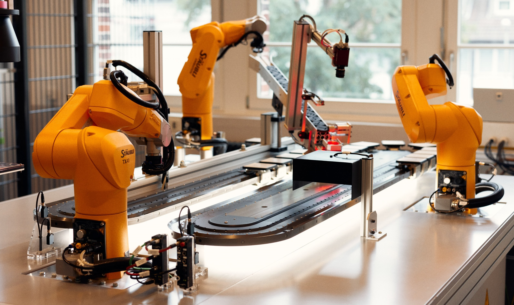
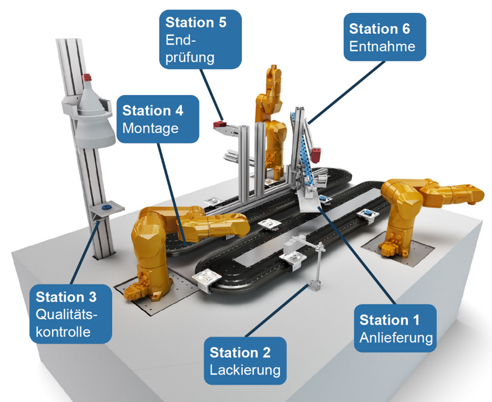
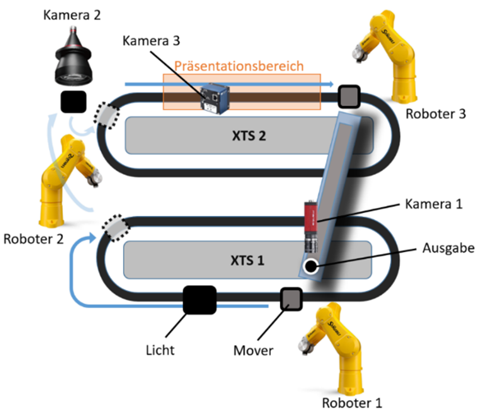

# efa-Demonstrator
Willkommen im Wiki zum efa-Demonstrator – einer modularen Produktionsanlage zur Demonstration industrieller Automatisierung, Robotik, Bildverarbeitung und Losgröße-1-Fertigung. 

> :fontawesome-solid-language: Use the automatic translator of your browser to read this site in your preferred language.

	  
	 efa-Demonstrator

## Inhalt des Wikis

-   :material-shield-check:{ .lg .middle } **Sicher arbeiten**

    ---
    Informieren Sie sich über Gefährdungen und umgesetzten Sicherheitsmaßnahmen.

    [Sicherheitsmaßnahmen öffnen](Sicherheitsmassnahmen.md)

-   :material-robot-industrial:{ .lg .middle } **Technik verstehen**

    ---
    Grundlagen zu Robotik, Vision, TwinCAT und Automatisierung auffrischen.

    [Grundlagen lesen](./Grundlagen/index.md)

-   :material-map-search:{ .lg .middle } **Überblick gewinnen**

    ---
    Verstehen Sie Aufbau, Stationen und Zusammenspiel der wichtigsten Systeme.

    [Komponenten entdecken](./Komponenten/index.md)

-   :material-console-line:{ .lg .middle } **Ansteuerung**

    ---
    Entwicklungsumgebung einrichten und erste Schritte mit TwinCAT, Kameras, Robotern und XTS durchführen.

    [Zur Ansteuerung](./Ansteuerung/index.md)

## Was zeigt der Demonstrator?

**Losgröße 1**  
Individuelle Wörter aus den Buchstaben E, F, A, S und T werden flexibel zusammengestellt.

**Flexible Bewegung**  
Zwei Beckhoff-XTS-Systeme transportieren Produkte und positionieren sie präzise.

**Robotik & Vision**  
Drei Stäubli-Roboter und drei Kameras übernehmen Handhabung, Vermessung und Prüfung.

**TwinCAT-Steuerung**  
SPS, HMI, Bildverarbeitung und Diagnose werden in einer industriellen Steuerungsumgebung umgesetzt.

## Hintergrund
Der efa-Demonstrator wurde in einem Projekt des Technologie-Netzwerks "Intelligente Technische Systeme OstWestfalenLippe" (it's owl) gemeinsam mit der Hochschule Bielefeld und weiteren Projektpartnern, wie Beckhoff Automation, Schirmer und Nobilia, entwickelt. Die Idee war es eine Anlage zur Herstellung eines kunden-individuellen Produkts in Losgröße 1 zu entwickeln. Als Produkte sollen hierbei Worte aus Buchstaben (E,F,A,S,T) gebildet werden. Folgende Rahmenbedingungen wurden festgelegt:

- Freie Wahl der Worte
- Lackierung der Bauteile in Wunschfarbe
- Hohe Fertigungsqualität der Bauteile
- Fehlerfreie Kombination zu den Wunschworten
- Energieeffiziente Herstellung
- Sicherer Produktionsprozess

## Stationen am Demonstrator

	  
	 Stationen des efa-Demonstrators

1. **Anlieferung**  
   Buchstaben werden geliefert und auf Notwendigkeit und Ausrichtung geprüft.

2. **Lackierung**  
   Mit Wunschfarbe lackieren.

3. **Qualitätskontrolle**  
   Überprüfung der Fertigungsqualität.

4. **Montage**  
   Positionierung der Buchstaben an richtige Stelle im Wort.

5. **Endprüfung**  
   Auf Korrektheit prüfen.

6. **Entnahme**  
   Wort entfernen, damit nächste Eingabe erfolgen kann.

## Demonstrationsprogramm
Folgende Funktionsweise wurde als Demonstration programmiert: Der Demonstrator bildet automatisch gewünschte Wörter auf dem Präsentationsbereich des XTS 2 (siehe Abbildung unten). Der Ablauf startet bei der Ausgabe. Die Kamera 1 detektiert hier den aktuellen Buchstaben und dessen Orientierung. Der Roboter 1 legt anschließend den Buchstaben aus der Ausgabe in richtiger Ausrichtung auf einen Mover des XTS 1. Der Mover fährt die Buchstaben im Uhrzeigersinn. Er wird kurz unter einem Licht gestoppt und fährt anschließend weiter. Auf der linken Seite wird der Buchstabe von dem Roboter 2 aufgenommen. Je nachdem, ob der Buchstabe im Wort enthalten ist oder nicht, wird der Buchstabe weiterverarbeitet. Die Mover des XTS 2 sind so angeordnet, dass in der Mitte das geforderte Wort entsteht. Die seitlichen Mover dienen zum Abtransport der nicht benötigten Buchstaben. Ist ein Buchstabe, der vom XTS 1 kommt nicht im Wort enthalten, so wird dieser vom Roboter 2 direkt auf einen der seitlichen Mover gelegt, abtransportiert und vom Roboter 3 wieder in die Ausgabe gelegt. Ist der Buchstabe im Wort enthalten, so wird dieser von dem Roboter 2 unter die Kamera 2 gelegt. Hier wird der Buchstabe vermessen. Ist der Vermessungsprozess abgeschlossen, so legt der Roboter 2 den Buchstaben auf den entsprechenden Mover des XTS 2. Sind alle benötigten Buchstaben auf den Movern platziert, so fahren diese zum Präsentationsbereich und werden von der Kamera 3 auf die richtige Ausrichtung überprüft. Nach kurzer Zeit werden die Buchstaben vom Roboter 3 wieder in die Ausgabe gelegt und ein neues Wort kann in Auftrag gegeben werden.

	  
	 Schematischer Aufbau des efa-Demonstrators

